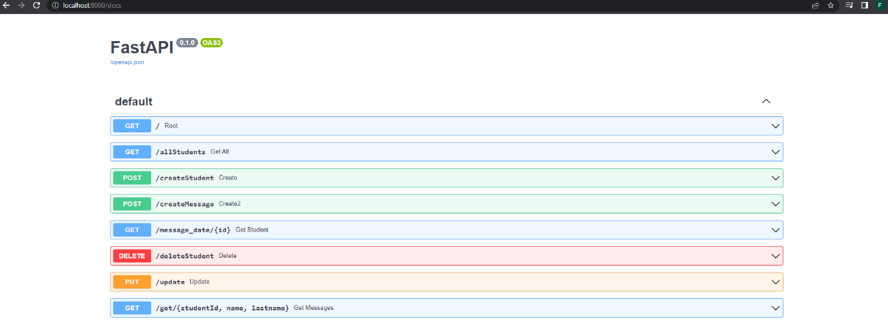

# FastAPI_MongoDB_Python
Implementation of Python FastAPI Interface to collaborate with MongoDB queries. Based on Unicorn web server.

# About

Two collections were made in the project: students, messages. 

The application allows: 
- Return all messages of the selected student by {id, name and surname}.
- Based on the id of the message, it returns the student's data.
- Allows you to add, new messages.
- Basic operations included in restAPI: add,delete,edit.

Code was tested with MongoDB Compass

# 🛠 Tools

  
  
  
  
  <a href="https://www.uvicorn.org/" target="_blank" rel="noreferrer"> 

 
<strong>FastApi</strong> - Python Framework 
<strong>PyMongo</strong> - Python Library 
<strong>Uvicorn</strong> - ASGI (Asynchronous Server Gateway Interface) web server

###

###
